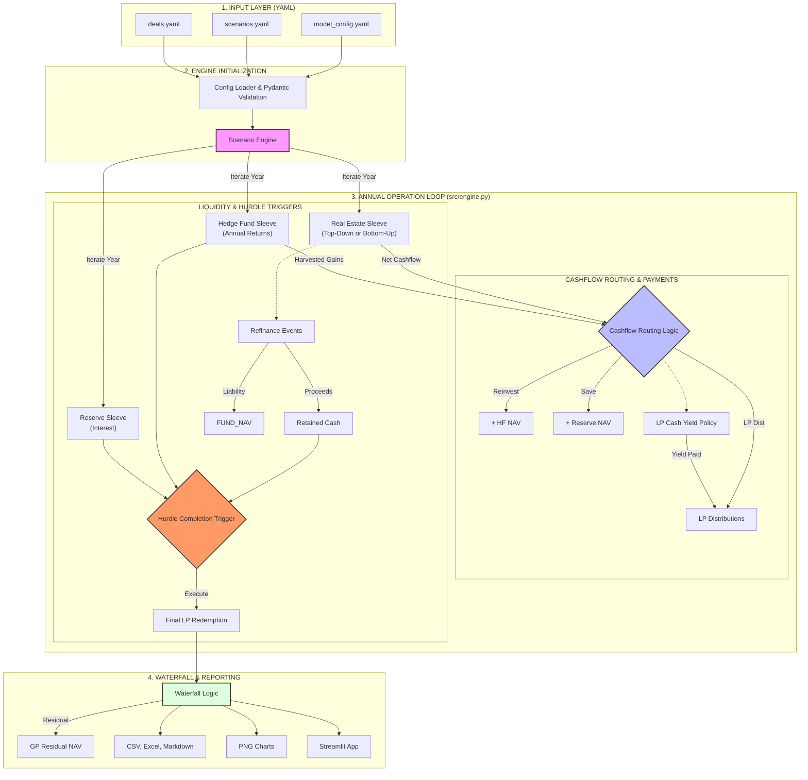

# Hybrid Fund Model Architecture

The following diagram represents the core architecture and data flow of the Hybrid Fund Economic Model.

### Key Logic Verification (How the Engine works):
1.  **Acquisition First:** At the start of each year, the model checks for new acquisitions. It tries to fund them using *Retained Cash* first, then the *Reserve*.
2.  **Sleeve Operations:**
    *   **Real Estate:** Calculates NOI, Debt Service, and Capex. If `bottom_up`, it sums all active individual deals.
    *   **Hedge Fund:** Appreciates by the scenario return and then "harvests" gains if configured.
    *   **Reserve:** Appreciates by its annual return.
3.  **Cashflow Routing:** Generated cash from RE and HF is split between the LP, reinvestment into the HF, and the Reserve based on configured percentages (must sum to 100%).
4.  **LP Yield Policy:** If enabled, the model attempts to pay a target annual yield to the LP *before* other routing, sourced from RE cashflow, HF harvests, and the Reserve.
5.  **Refinance:** Both scenario-level and deal-level refis generate cash (usually to Retained Cash or Reserve) and increase a "Refinance Liability" which reduces the overall Fund NAV.
6.  **Hurdle Trigger:** This is the terminal logic. It calculates if the LP's 2.0x target can be met by liquidating the HF, using the Reserve, using Retained Cash, and performing a final refinance. If the total liquidity ≥ remaining hurdle, the scenario finishes.
